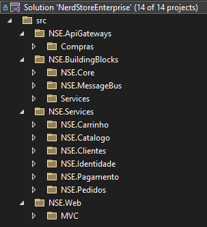

# Enterprise Applications

## Características do projeto
  Um exemplo de aplicação corporativa utilizando ASP.NET Core juntamente de uma modelagem complexa, aplicando os conceitos do DDD, CQRS e EventSourcing

  .NET SDK Version: [net6.0](https://dotnet.microsoft.com/en-us/download/dotnet/6.0)

  Modelagem (patterns): [DDD](https://en.wikipedia.org/wiki/Domain-driven_design), [CQRS](https://docs.microsoft.com/pt-br/azure/architecture/patterns/cqrs), [Event sourcing](https://microservices.io/patterns/data/event-sourcing.html), [Mediator](https://pt.wikipedia.org/wiki/Mediator)

  Mensageria: [RabbitMQ](https://en.wikipedia.org/wiki/RabbitMQ), [EasyNetQ](https://easynetq.com/)

  ORM: [EntityFramework Core](https://pt.wikipedia.org/wiki/Entity_Framework), [Dapper](https://en.wikipedia.org/wiki/Dapper_ORM)

  Deploy: [Docker](https://en.wikipedia.org/wiki/Docker_(software)) / [Azure](https://en.wikipedia.org/wiki/Microsoft_Azure)

---

## Camadas da aplicação

  

---

  Plataforma de aprendizagem : [desenvolvedor.io](https://desenvolvedor.io/cursos)  
  Curso : [ASP.NET Core Enterprise Applications](https://desenvolvedor.io/curso-online-asp-net-core-enterprise-applications)  
  Instrutor : [Eduardo Pires](https://desenvolvedor.io/instrutor/eduardo-pires)
